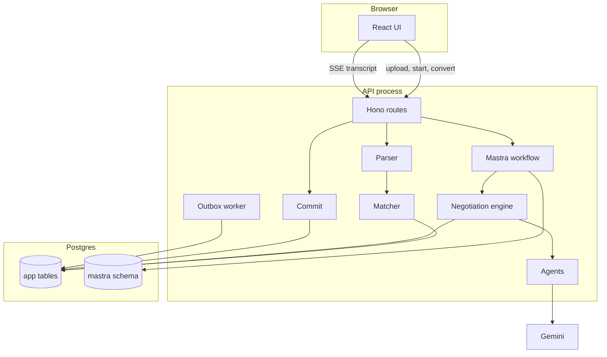
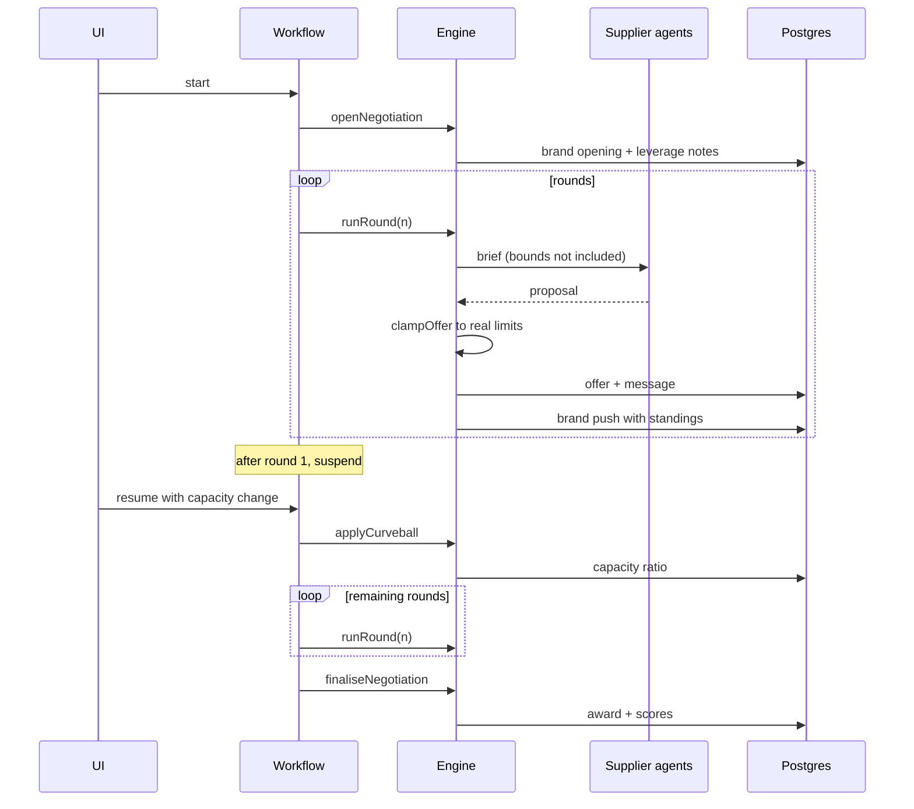
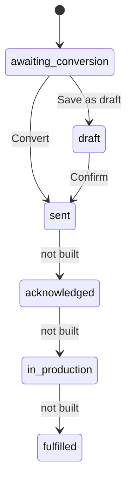
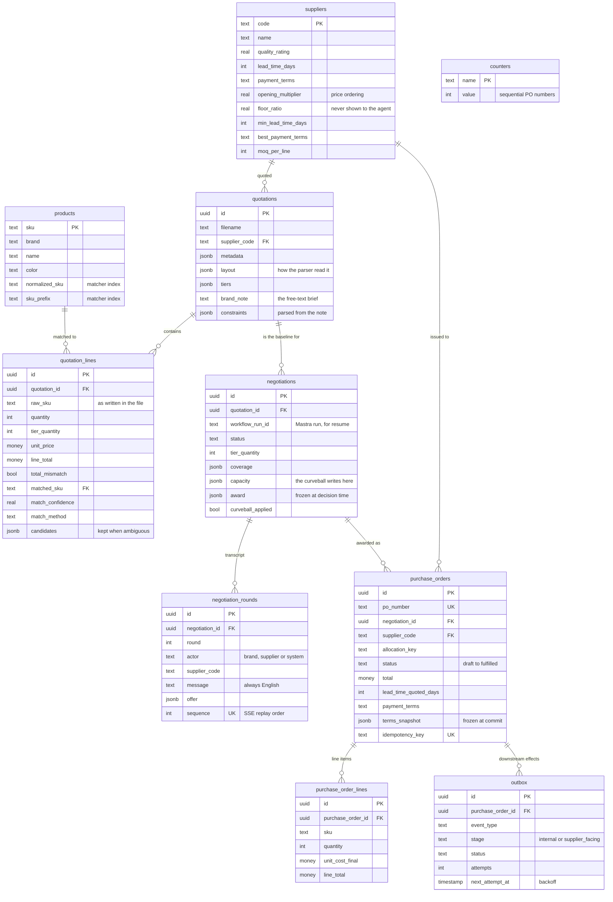

# Architecture

The full walkthrough: what each component does, how data moves from an uploaded spreadsheet to a
committed purchase order, and where the state lives at each point.

---

## 1. The shape of the system

Three processes: Postgres, the Hono API, and the Vite dev server. Mastra runs in-process inside the
API and keeps its workflow snapshots in a separate `mastra` schema in the same database.

The API is the only thing that talks to the database. The UI holds no domain logic; it renders what
the API decided, including the score breakdown, so the comparison on screen is the one the award was
made from rather than a second calculation that could disagree.

---

## 2. Parsing

`apps/api/src/parser/`

The brief promises a spreadsheet we have not seen, so nothing here is keyed to a filename, a sheet
name or a header string.

**`read-workbook.ts`** turns the file into a rectangular grid of typed cells. Three things happen
that matter:

- Merged ranges are expanded. exceljs points every covered cell at its merge master, so reading
  through `master` turns a merged title block into a grid every later stage can index.
- Floats are snapped to six decimals. Excel stores 23988 as 23987.999999999996 once a formula has
  touched it, and left alone that becomes a line total that disagrees with quantity times price.
- Dates come back as dates whether they were stored as serial numbers or as text.

Anything that is not a readable zip fails here with a message aimed at a person, not a stack trace.

**`heuristics.ts`** finds the table without being told where it is. It scores each row on whether it
behaves like a line item — does it hold something SKU-shaped, something description-shaped, a
quantity, a price — and takes the longest run of rows that agree. Header roles come from three
independent signals:

1. Header text (`Item #`, `Unit price`, `Total price`).
2. What the values in the column actually look like.
3. Arithmetic. If column C equals A × B all the way down the block, C is the line total whatever the
   header calls it. This is what saves the files where a header is missing or wrong.

**`llm.ts`** is an optional second opinion on column roles, used only where the heuristics are
uncertain. Offline it is skipped entirely, and all four fixtures parse correctly without it.

**`extract.ts`** pulls the lines out. Unit prices keep four decimals — at 5,000 units a rounded
half-cent is a $25 error — and the line total is computed from the higher-precision price before
being rounded, so the PO cannot drift from the quotation it came from. Where the printed total
disagrees with quantity times price, the computed value wins and the row is flagged `totalMismatch`
for the review screen.

**`metadata.ts`** reads what is lying around outside the table: supplier name, currency, quotation
date, payment terms, lead time. These frequently contradict the supplier's profile, which is not a
bug — it is leverage, and the negotiation surfaces it as such.

Tier detection deserves a note. A quantity that appears against most SKUs is a pricing tier; a
quantity that appears against one is just that line's quantity. `tiersFrom` uses that distinction, so
`quotation_2`'s 1,000 and 5,000 tiers are found without hardcoding either number.

---

## 3. Matching

`apps/api/src/matching/`

`products.csv` is the source of truth and some spreadsheet SKUs have typos. The matcher runs four
tiers in order and stops at the first hit:

| Tier | What it catches | Confidence |
| --- | --- | --- |
| exact | identical string | 1.0 |
| normalised | case, spacing, punctuation | 0.98 |
| padded | dropped or added leading zeros | 0.92 |
| fuzzy | homoglyphs and single-character slips, within an edit-distance bound and the same SKU prefix | 0.75–0.88 |

The fuzzy tier is bounded on purpose. It folds character look-alikes (`0`/`O`, `1`/`I`/`l`, `5`/`S`)
and allows a small edit distance, but only within the same SKU prefix — matching `OJ3008` to
`PWW017` because they are both six characters would be worse than not matching at all. Where several
candidates tie, all of them are kept on the line and shown in the UI rather than one being picked
silently.

---

## 4. Building the basket

`apps/api/src/negotiation/setup.ts`, `coverage.ts`

The basket is what everyone bids on: one line per matched SKU at the chosen tier quantity, with the
incumbent's price as the baseline.

The interesting case is a SKU the incumbent did not price at this volume. `quotation_2` has two. The
naive options are both wrong: dropping the line means the brand cannot buy something it wants, and
leaving the baseline at zero means every rival looks infinitely expensive on that line. Instead the
baseline is extrapolated from the incumbent's own price elasticity across the tiers it did quote, and
the line is marked `baselineExtrapolated`. The other suppliers bid on it normally, the brand agent
says out loud that this business is genuinely open, and the comparison stays honest.

Coverage is a per-line vector rather than a flag, which is what lets four different reasons for a
shortfall share one mechanism:

- the incumbent never priced the tier,
- the SKU did not match the catalog,
- the supplier declined the line,
- the supplier is capacity-limited (the curveball).

All four produce the same `LineCoverage` shape, so the allocator and the scorer handle the curveball
with no special case for it.

---

## 5. The negotiation

`apps/api/src/negotiation/engine.ts`, `apps/api/src/agents/`, `apps/api/src/workflows/`

The workflow steps are deliberately thin. They hold a negotiation id and a round number and nothing
else; every step reloads the world from the database. That is what makes resume a resume — there is
no in-memory state that a restarted process would lose, and no snapshot that could disagree with the
rows.

**Bounds are enforced in code, never in prompts.** `clampOffer` in `agents/bounds.ts` pulls any
proposal back inside the supplier's real floor price, minimum lead time, best payment terms, maximum
rebate and maximum freight allowance. A prompt saying "do not go below X" is a request; this is a
guarantee. When a clamp fires it is recorded on the offer and shown in the transcript, because a
supplier hitting its floor is information the buyer should have.

**Suppliers concede along five levers**, not one. Price, lead time, payment terms, volume rebate,
freight allowance. Each is already a dimension in the scoring function, so "I'll hold price but pay
your freight" moves the ranking through the same arithmetic as a discount would. This is what makes
the transcript read like a negotiation rather than an auction.

---

## 6. Scoring and allocation

`packages/shared/src/scoring.ts`, `apps/api/src/negotiation/allocation.ts`, `award.ts`

Candidate plans are built first: each supplier alone, a greedy split across everyone, and a greedy
split across only those who satisfy the hard constraints. Then every plan is scored by one pure
function.

The score combines four normalised components weighted by the brand's note:

- **Cost** is effective cost: landed (quoted + freight + duty by origin) plus the cash-flow cost of
  the payment schedule plus a switching penalty per extra supplier. Paying 100% upfront for goods
  arriving in 50 days ties up capital for 50 days, and that is what makes it genuinely worse than
  40/60 rather than merely less pleasant.
- **Quality** is weighted by landed value, not averaged across suppliers.
- **Lead time** is the slowest supplier in the plan. You wait for the last container.
- **Payment terms** is the same cash-flow number expressed as its own dimension.

Coverage scales the result, and hard constraints from the note (a deadline, a quality floor, a
budget) disqualify rather than penalise. A disqualified plan is still shown, with its reason, because
"why not the cheap one" is the first question anyone asks.

**MOQ repair.** A greedy split routinely lands a supplier below its minimum order quantity on a line.
The repair pass moves that quantity to or from another supplier on the same line — never inflating
the total order, which would be buying goods to satisfy an arithmetic constraint. It is capped at two
passes and asserts on every line that nothing is over-allocated. Infeasibility is a recorded outcome,
not a thrown error.

---

## 7. Committing

`apps/api/src/purchase-orders/commit.ts`, `outbox.ts`

`sent` is where this system stops. The three transitions after it are in the `po_status` enum and have
badge colours in the UI, but nothing sets them: they are the shape of the lifecycle this would join,
not behaviour that exists. Everything past issuing the order is the supplier's reply and the
factory's progress, which is a different system's job to report.

Convert is the primary action and goes straight to `sent`, because the brief calls the list "POs the
brand has issued". Save-as-draft exists for the internal-approval path and withholds only the
supplier-facing effects; the internal ones (reserving capacity, scheduling payment tranches, routing
to finance) fire either way.

One transaction does all of this:

1. Allocate a PO number by atomic increment, so two simultaneous commits cannot collide.
2. Write the PO with `terms_snapshot` — a full copy of the agreed terms, not a reference. A purchase
   order that re-reads a mutable negotiation is not a commitment.
3. Write the lines.
4. Enqueue the outbox events.

Idempotency is keyed on the client's key plus the allocation plus a hash of the terms. A replayed
commit returns what was written the first time. A commit whose terms have changed is a different
commit and is allowed through.

The outbox worker claims one row at a time with `FOR UPDATE SKIP LOCKED`, so a second API instance
cannot send the same notification twice. Failures back off exponentially and dead-letter after five
attempts, because an effect that will never succeed on a committed order is something a human needs
to see.

---

## 8. The data model

Nine tables in the `public` schema, plus whatever Mastra keeps in its own `mastra` schema. `products`
and `suppliers` are seeded reference data; everything else is written by the flow.

Three things in that diagram carry most of the design:

- **`negotiations` has one row per negotiation, not one per supplier.** All four suppliers bid on the
  same basket, so capacity, coverage and the award are properties of the negotiation. The curveball is
  a single write to `capacity`, which is what lets it be absorbed rather than restarted.
- **`purchase_orders` hangs off the negotiation, not the quotation.** A split award writes one row per
  supplier, distinguished by `allocation_key`, and `idempotency_key` makes a double-clicked Convert
  return the existing PO rather than a second one.
- **`terms_snapshot` duplicates data that is already in the negotiation.** Deliberately. A purchase
  order that re-reads mutable upstream rows is not a commitment.

---

## 9. Where state lives

| State | Home | Why there |
| --- | --- | --- |
| Parsed lines and matches | `quotation_lines` | Survives a reload; the review screen is not holding it |
| Negotiation transcript | `negotiation_rounds` | The SSE stream reads rows, so a reconnect loses nothing |
| Supplier capacity | `negotiations.capacity` | One ratio per supplier; the curveball writes here and nothing else changes |
| Workflow position | Mastra's `mastra` schema | Survives a process restart mid-negotiation |
| Award and scores | `negotiations.award` | Frozen at the moment the decision was made |
| Agreed terms | `purchase_orders.terms_snapshot` | A commitment cannot depend on mutable upstream data |
| Pending effects | `outbox` | Enqueued in the commit transaction, delivered after it |

Nothing lives in process memory between requests. That is the property that makes the curveball a
resume and the SSE stream restart-safe, and it is why the workflow steps can afford to be trivial.
