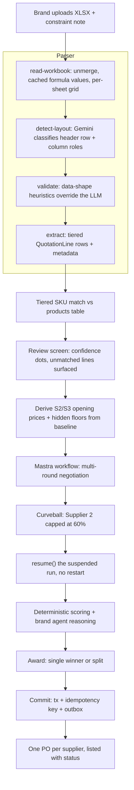
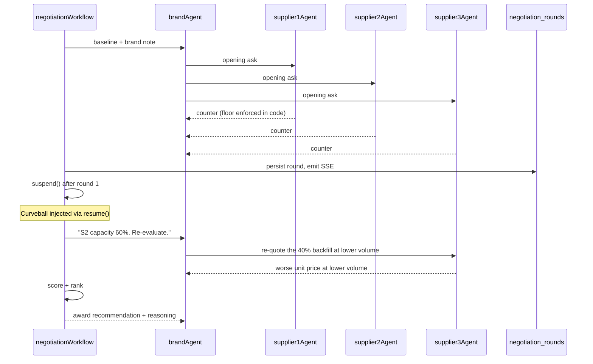
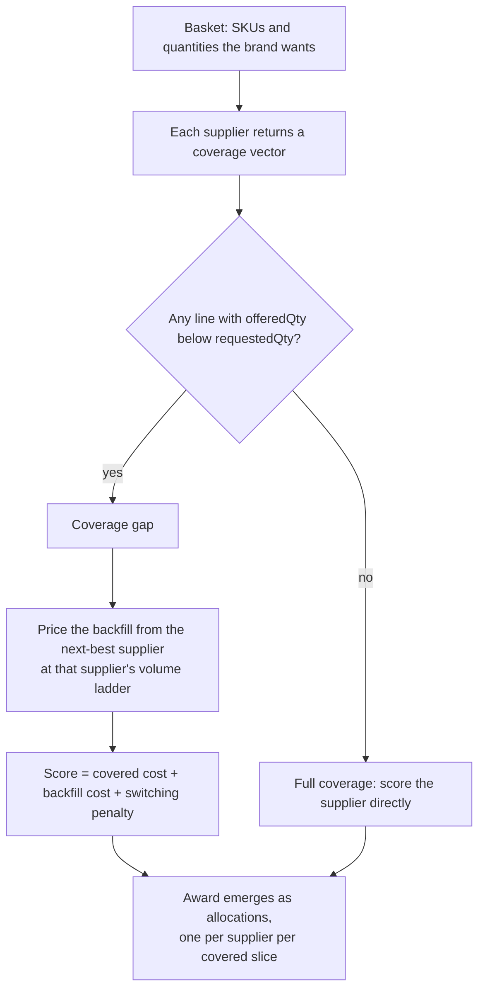
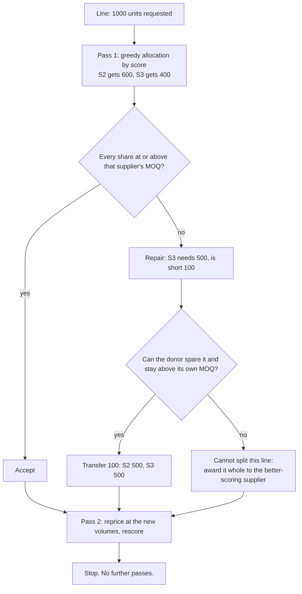
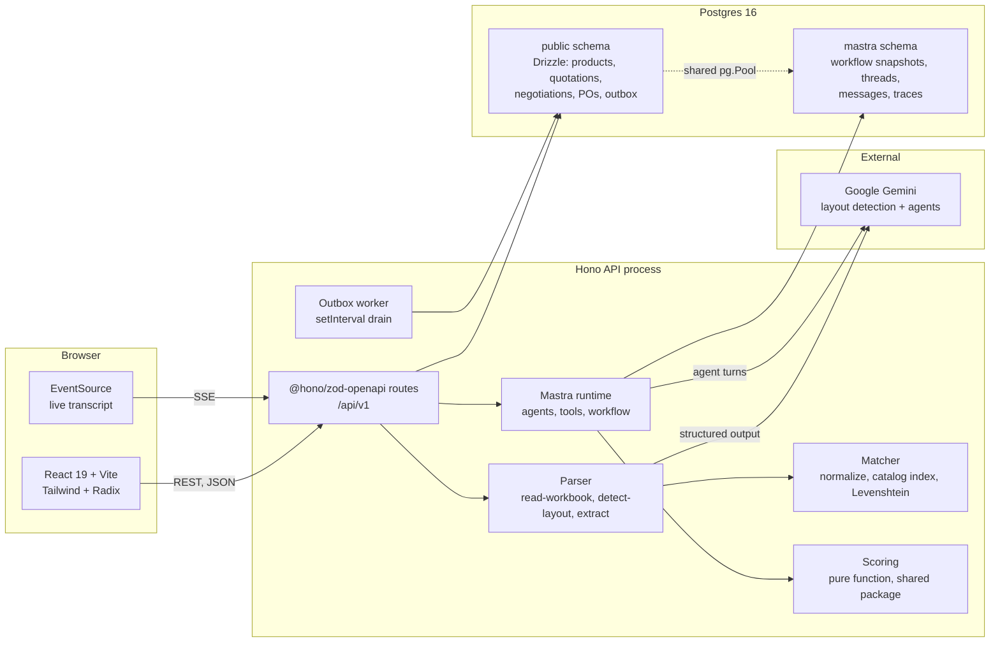
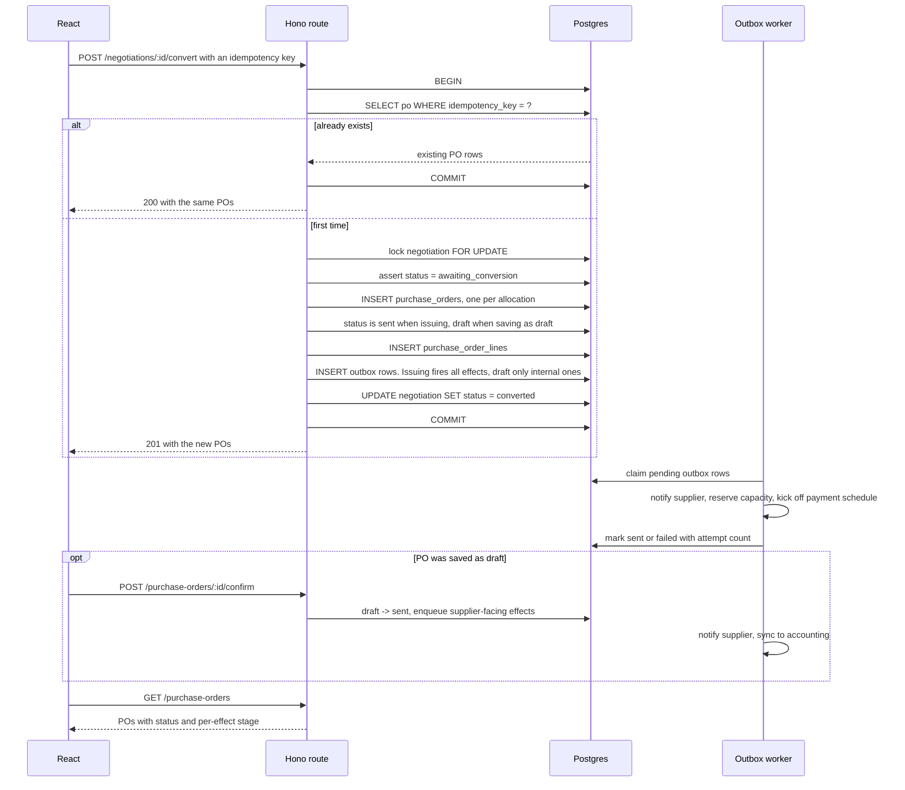
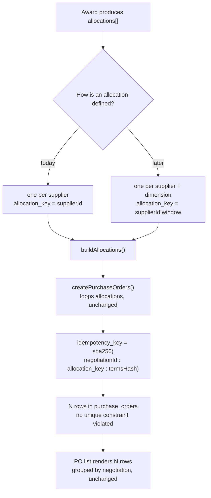

## Smart Quotation — Implementation Plan

Locked decisions from grilling rounds 1 and 2: React (Vite) + Hono in a pnpm workspace, Google Gemini via Mastra 1.x, hybrid parser, tiered deterministic SKU matching, derived supplier pricing with hidden floors, basket-level negotiation, split awards allowed, SSE-streamed transcript, one PO per supplier, transactional outbox commit, focused test suite.

---

## 0. Glossary

Sourcing vocabulary used throughout this plan, the code, and the UI copy. Terms are defined again inline the first time they appear in prose.

- **SKU** — stock keeping unit. The identifier for one exact sellable variant, so `MC001-GLW-M` is a specific product in a specific colour in size M. Style, colour, and size are separate SKUs.
- **Quotation** — a supplier's price offer for a list of SKUs. The XLSX being uploaded.
- **RFQ** — request for quotation. The brand asking suppliers to quote. In this challenge the quotation arrives first and is used as leverage, so RFQ appears mainly as vocabulary inherited from the PRD.
- **PO** — purchase order. The binding commitment to buy. The commit artifact at the end of the flow.
- **Basket** — our term for the set of SKU-and-quantity pairs the brand actually wants to buy, derived from the parsed quotation after catalog matching.
- **FOB** — free on board. The price covers the goods loaded onto the vessel at the supplier's port; freight, insurance, and import duty are the buyer's cost. Both `quotation_2` and `quotation_3` quote FOB, which is why FOB price alone is not the real cost.
- **Landed cost** — the true per-unit cost once freight, duty, and other import costs are added to the FOB price. The honest basis for comparing suppliers in different countries.
- **Lead time** — days from order placement to goods being ready to ship. Supplier 1 quotes 50 days, Supplier 2 quotes 25, Supplier 3 quotes 15.
- **Payment terms** — when the buyer pays, expressed as percentage tranches. A tranche is one scheduled instalment. `33/33/33` means a third at order, a third at some milestone, a third on delivery. `40/60` means 40% upfront and 60% later. `100% upfront` means the buyer funds the entire order before receiving anything, which is the worst case for the buyer's cash flow even when the unit price looks good.
- **Cash-flow cost of payment terms** — the money cost of paying early. Paying upfront ties up capital that could otherwise sit in the bank or fund other orders, so we convert payment terms into a comparable number rather than treating them as a footnote.
- **MOQ** — minimum order quantity. The smallest batch a factory will produce for a given item. An MOQ ceiling is the inverse: the most they will commit to.
- **Incoterms** — international commercial terms. The standard three-letter codes defining where the seller's responsibility ends and the buyer's begins. FOB is one of them. Amber's quotation wizard asks for incoterms alongside currency.
- **HTS code** — harmonized tariff schedule code. The classification number that determines the import duty rate for a product. Amber infers it to calculate landed cost.
- **BoM** — bill of materials. The list of components and fabrics in a product. Amber uses it plus origin and destination to compute duties.
- **Draft order** — a PO that exists and has frozen terms but has not yet been sent to the supplier, pending internal approval. Amber's stage between negotiation and a live order.
- **Markup vs margin** — two ways of expressing profit on the same numbers. Markup is profit over cost, margin is profit over selling price. Amber lets the user toggle between them.
- **Tier pricing** — a lower unit price at a higher quantity. All four spreadsheets express tiers, each in a different layout.
- **Coverage** — our term for how much of the basket a given supplier can actually supply and price. See section 3.
- **Coverage gap** — a line the supplier cannot fill, whatever the cause. Must be backfilled by another supplier.
- **Split award** — dividing one order across more than one supplier because no single supplier covers the basket well enough.
- **Backfill** — sourcing the uncovered remainder from another supplier, usually at a worse unit price because the volume is smaller.
- **Quality scorecard** — the supplier's quality rating out of 5. Supplier 1 and 3 sit at 4.0, Supplier 2 at 4.7. The brand agent knows these and weighs them against price.
- **Price floor** — the lowest unit price a supplier will accept before walking away. Hidden from the brand agent and enforced in code, not by prompt.

---

## 1. What the data actually looks like

Verified by unzipping all four workbooks and reading the sheet XML directly. This drives every parser decision.

- `quotation_1.xlsx` — 15 preamble rows, 20 merged ranges, header at row 16 (`Item # | Description | Qty | Unit price | Total price`), two quantity tiers as **stacked row blocks** (500 then 5000), formula cells, Excel serial date `46023`.
- `quotation_2.xlsx` — no preamble, tiers as **columns** (`Unit FOB Price - Qty 1000` / `Qty 5000`; FOB, "free on board", means the price covers goods loaded at the supplier's port and excludes freight and duty), **no quantity column at all**, `Payment 30/70` and `Lead Time 90 days` in footer rows 28-29, and two rows quoted at the 1000 tier but not at 5000 — `OJ3008-SRD-XL` and `OPP012-OBS-32-28`. Verified in the raw XML: the column C cell element is absent entirely, not empty and not zero.
- `quotation_3.xlsx` — metadata rows 1-7 (factory, date, currency, payment terms, lead time), header at row 8, a `Discount (%)` column, a `TOTAL` row, tiers as **two sheets**.
- `quotation_4.xlsx` — **Chinese headers**, and the headers lie: `单价` (unit price) sits above quantity data, `数量` (quantity) above price data. Column order must be inferred from data shape, not header text.

Typo classes confirmed in the files: zero-for-O (`0PP027`, `MB013-0BS`, `AQ009-0BS`), O-for-zero (`MBOO2`, `MH01O`), lowercase-L-for-I (`PWE016-lCB`), dropped digits (`EKA03` → `EKA003`, `PHS8`, `PWW17`).

Catalog: 10,053 rows, brands `valden` (9133) and `solenne` (920). Dirty rows exist — 130 with literal SKU `as-DWD-30-24` and an empty name, 3 missing the size segment. The matcher must not crash or false-match on these.

---

## 2. End-to-end flow




---

## 3. Negotiation engine

Mastra 1.x. `AgentNetwork` and `.network()` are deprecated; the durable primitive is a workflow `.dowhile()` with `suspend()`/`resume()` inside the loop body, which is the only pause point that survives a process restart.




### The concession space: how suppliers win deals without just cutting price

The brief is specific that "supplier agents should behave realistically — suppliers don't just accept or reject, they find ways to win the deal". A design where the only lever is unit price fails this outright, because the only two moves available are capitulate or refuse.

So each supplier agent gets a **concession space**: a set of levers, each with a real cost to that supplier, which it may trade against price. The agent chooses which to spend; the code enforces what it may not exceed.

- **Unit price** down to the hidden floor.
- **Lead time** compression, bounded per supplier. Supplier 3 is already at 15 days and has little room; Supplier 1 at 50 days has plenty and will use it, because it is the cheapest and slowest and needs a story.
- **Payment terms** improvement. Supplier 3 opens at 100% upfront, which is the worst case for the brand's cash flow, so shifting to 50/50 costs Supplier 3 little and is worth a lot to the buyer. This is often the cheapest concession available and a realistic agent reaches for it early.
- **Volume rebate** at a tier threshold, which interacts with the tier pricing already in the data.
- **Freight allowance**, which moves FOB price toward landed cost without touching the unit price the supplier quotes publicly.
- **Capacity guarantee**, which is what Supplier 2 must offer after the 60% curveball if it wants to stay in the deal at all.

Two properties make this work rather than being decoration. First, every lever is already a dimension in the scoring function, so a concession changes the ranking through the same arithmetic as a price cut, and the brand agent can honestly say a slower supplier won on cash flow. Second, each lever has a per-supplier bound enforced in a tool, so an agent cannot promise 5-day delivery to win an argument.

This is also what makes the curveball interesting rather than mechanical: Supplier 2 is the highest quality at 4.7 and now covers only 60%, so its only path to staying relevant is to spend concessions elsewhere.

### Natural language is a hard requirement

Every turn persists a natural-language message alongside its structured offer. The brief requires that "agents should communicate in English using natural language", and a design that leans on structured output can quietly reduce the transcript to a table of numbers. So `negotiation_rounds.message` is non-nullable, and a test asserts every round carries prose a human would recognise as an argument, not a serialized object.

Three things stay in deterministic code, never in a prompt:

- **Cost floors.** Each supplier gets `floor = opening * 0.88`. A tool validates every offer; sub-floor offers are rejected and the agent is told to try again. Prompts alone cannot be trusted here.
- **Opening prices.** `S2 = baseline * 1.25`, `S3 = baseline * 1.10`, with per-SKU jitter from a hash of the SKU so it looks organic and is reproducible run to run.
- **Scoring.** A pure function over landed cost (the FOB price plus freight and duty, so suppliers in different countries compare fairly), quality scorecard, lead time in days, and the cash-flow cost of the payment terms (paying 100% upfront ties up capital, so it is converted to a number rather than left as a footnote). Weights shift according to the brand's constraint note. Snapshot-tested. The agent explains the ranking; it does not compute it.

Volume sensitivity is what makes the curveball real: when Supplier 3 is asked to cover only 40% of the order, its price ladder returns a worse unit price, so the split is not automatically the cheapest answer.

### Where Supplier 1's terms come from

The brief assigns Supplier 1 a 50-day lead time and 33/33/33 payment terms. The spreadsheets disagree: `quotation_2.xlsx` states 90 days and 30/70, `quotation_3.xlsx` states 60 days and 40/60, and the unseen test file will state something else again.

**The parsed file wins.** The entire premise is that the upload is the baseline the brand negotiates from, so inventing terms that contradict the document in front of the user would undermine the demo. The brief's 50 days and 33/33/33 are the fallback for when a file states nothing, which is the case for `quotation_1.xlsx` and `quotation_4.xlsx` (the latter gives a lead time of 60 days but no payment terms).

When the file and the brief disagree, the review screen shows both. That gap is negotiating leverage rather than a bug: a supplier whose standard terms are 33/33/33 but who quoted 30/70 on this deal has already moved once, and the brand agent should know it.

### Coverage: one mechanism for every shortfall

A supplier failing to supply the whole order shows up in this system through several different doors, and it would be a mistake to write a separate code path for each. They are all the same fact: **this supplier cannot cover 100% of the basket**, where the basket is the set of SKU-and-quantity pairs the brand wants to buy.

The doors:

- The quote never priced a line at the required tier — `OJ3008-SRD-XL` and `OPP012-OBS-32-28` in `quotation_2.xlsx`, which in sourcing terms usually signals an MOQ ceiling (MOQ, "minimum order quantity", is the smallest batch a factory will run; a ceiling is the inverse — the most they will commit to) or an item that is made-to-order or being discontinued.
- The SKU in the spreadsheet never matched the catalog, so we cannot responsibly buy it.
- The supplier announces a capacity limit mid-negotiation — the Supplier 2 curveball at 60%.
- The supplier simply refuses a line during negotiation.

So every offer carries a coverage vector rather than a flat price list:

```ts
type LineCoverage = {
  sku: string
  requestedQty: number
  offeredQty: number          // 0 means no coverage at all
  unitPrice: number | null    // null when offeredQty is 0
  reason: 'quoted' | 'no_price_at_tier' | 'capacity_limited' | 'unmatched_sku' | 'declined'
}
```




Three things fall out of this, which is why it is worth the abstraction:

1. **The curveball stops being special.** "Supplier 2 can only fulfil 60%" is an update to one supplier's coverage vector, applied through the workflow's `resume()`. The re-evaluation logic is the logic that already ran in round one.
2. **The split award emerges rather than being a feature.** A split is simply what happens when no single supplier covers the basket at an acceptable score. Allocations come out of covering the basket, and each allocation becomes one PO, which is exactly the shape section 6.3 needs.
3. **Scoring stays honest.** A supplier missing two lines is not cheapest just because it quoted fewer things. Comparing a partial quote against a full one requires pricing the backfill at the next-best supplier's rate for that reduced volume, plus a switching penalty for the operational cost of running two suppliers instead of one.

The missing 5000-tier rows are therefore a first-class demo moment, not an edge case swept under a null check: the file itself hands us a coverage gap before any agent has spoken.

### Allocation with MOQ: greedy plus repair

Once a line is split across suppliers, each supplier's share must still clear that supplier's MOQ — the minimum batch they will produce. Splitting 1,000 units 60/40 gives one supplier 400 units, and if their minimum is 500 the split is not buyable as drawn.

The general form of this is a constrained optimization problem and solving it properly means mixed-integer programming. That is not a 14-20 hour component. We implement a heuristic instead, and say so plainly:




The rules that keep this from becoming a science project:

- **Transfer, never inflate.** Repair moves quantity between suppliers; it never rounds the order up to satisfy a minimum. The basket total is invariant, so we never buy 1,100 units because a factory wanted a rounder number.
- **Two passes, hard stop.** Reallocating changes the volume, which changes the tier price, which changes the score, which would change the allocation. That is circular. We allocate, reprice and rescore once, and stop. No fixed-point iteration, no convergence loop that can spin.
- **Assert the invariants.** Every line's allocations sum to exactly the requested quantity, and every allocation is either zero or at least that supplier's MOQ. These are assertions in code, not hopes, and they are what the unit tests check.
- **Infeasibility is an outcome, not an exception.** When no split satisfies both minimums, the line goes whole to the better-scoring supplier and the reason is recorded and shown in the UI. The user sees "split not possible: Supplier 3 minimum is 500 units", not a silent single-supplier award.

MOQ values do not exist in `products.csv`, so each supplier gets an invented per-line minimum, derived deterministically so runs are reproducible. The brief permits made-up data that makes sense in context.

This is worth saying out loud in the video: it is a heuristic with a known ceiling, the ceiling is that greedy plus one repair pass can miss an allocation a real solver would find, and the upgrade path is a min-cost flow formulation with fixed-charge constraints. Naming the limitation is stronger than pretending there isn't one.

---

## 4. Folder structure

```
smart-quotation/
├── docker-compose.yml              # postgres 16
├── pnpm-workspace.yaml
├── .env.example                    # GOOGLE_GENERATIVE_AI_API_KEY, DATABASE_URL
├── README.md
├── fixtures/                       # products.csv + quotation_1..4.xlsx
├── packages/shared/src/
│   ├── schemas/                    # zod: quotation, line, offer, award, po
│   └── scoring/score.ts            # pure, imported by api and web
├── apps/api/src/
│   ├── index.ts                    # Hono + @hono/zod-openapi, /api/v1
│   ├── routes/
│   │   ├── quotations.ts           # POST /quotations (upload), GET /:id
│   │   ├── negotiations.ts         # POST start, GET /:id/stream (SSE), POST /:id/curveball
│   │   └── purchase-orders.ts      # POST /negotiations/:id/convert (-> draft),
│   │                               # POST /purchase-orders/:id/confirm (draft -> sent),
│   │                               # GET /purchase-orders
│   ├── db/{schema.ts,client.ts,seed.ts}
│   ├── parser/
│   │   ├── read-workbook.ts        # unmerge, cached formula values, float cleanup
│   │   ├── detect-layout.ts        # Gemini structured call: header row + column roles
│   │   ├── heuristics.ts           # data-shape checks that override the LLM (the q4 case)
│   │   ├── extract.ts              # tiers as rows / columns / sheets
│   │   └── metadata.ts             # payment terms, lead time, currency, supplier, date
│   ├── matching/{normalize.ts,catalog-index.ts,match.ts}
│   ├── coverage/
│   │   ├── build-basket.ts         # matched lines -> the basket being bought
│   │   ├── coverage.ts             # coverage vector per supplier, all four gap reasons
│   │   └── allocate.ts             # cover the basket -> allocations (single or split)
│   ├── pricing/derive.ts           # opening prices, floors, volume ladder
│   ├── mastra/
│   │   ├── index.ts                # PostgresStore schemaName 'mastra'
│   │   ├── agents/{brand.ts,supplier.ts}
│   │   ├── tools/{score-offer.ts,check-floor.ts,get-baseline.ts,capacity.ts}
│   │   └── workflows/negotiation.ts
│   └── commit/{create-po.ts,outbox-worker.ts}
├── apps/web/src/
│   ├── routes/{Upload,Review,Negotiation,PurchaseOrders}.tsx
│   ├── components/{MatchTable,TranscriptStream,ExplainTree,ConfidenceDot,ScoreBars,AwardPanel}.tsx
│   ├── components/CostBasisToggle.tsx    # FOB <-> landed cost, borrowed from Amber
│   ├── components/SupplierCompare.tsx    # side by side, down to line level
│   └── components/OutboxPanel.tsx        # downstream effects with stage and status
│   └── lib/{api.ts,sse.ts}
└── e2e/negotiation.spec.ts
```

---

## 5. Database schema

Drizzle owns `public`; Mastra owns its own `mastra` schema in the same Postgres so suspend/resume state and app data share one connection pool without colliding migrations.

- `products` — sku, brand, name, color. Seeded from `products.csv`.
- `suppliers` — name, country, scorecard_quality, lead_time_days, payment_terms, price_multiplier, floor_multiplier, capacity_pct.
- `quotations` — supplier_id, filename, currency, quotation_date, payment_terms, lead_time_days, layout jsonb (the detected layout, so parses are explainable and debuggable).
- `quotation_lines` — raw_sku, raw_description, qty, unit_price, line_total, tier_qty, matched_sku, match_confidence, match_method, status.
- `negotiations` — quotation_id, brand_note, status, workflow_run_id, award jsonb, reasoning jsonb.
- `negotiation_rounds` — negotiation_id, supplier_id, round_number, actor, message, offer jsonb, offered_at.
- `suppliers` also carries `moq_per_line` so allocation repair has a minimum to clear, plus the concession bounds (`min_lead_time_days`, `best_payment_terms`, `max_rebate_pct`, `max_freight_allowance`) that the enforcement tool checks.
- `suppliers` is seeded with exactly the brief's figures: Supplier 1 at quality 4.0, 50 days, 33/33/33, cheapest (its prices come from the uploaded file). Supplier 2 at quality 4.7, 25 days, 40/60, opening at 1.25x the baseline so it is genuinely the most expensive. Supplier 3 at quality 4.0, 15 days, 100% upfront, opening at 1.10x so it is genuinely mid-range. The multipliers are what guarantee the brief's cheapest/mid/expensive ordering actually holds against whatever file is uploaded.
- `purchase_orders` — negotiation_id, supplier_id, allocation_key, po_number, status (`draft`, `sent`, `acknowledged`, `in_production`, `fulfilled`), totals, lead_time_quoted_days, payment_terms, terms_snapshot jsonb, **idempotency_key unique**.
- `purchase_order_lines` — po_id, sku, quantity, unit_cost_final, line_total.
- `outbox` — po_id, stage (`internal` fired on convert, `supplier_facing` fired on confirm), event_type, payload, status, attempts.

`terms_snapshot` is the point of the commit: the PO freezes what was agreed, so later edits to the negotiation cannot rewrite history.

### Keeping N POs per supplier open

We build one PO per supplier now, but nothing in the schema forecloses several POs going to the same supplier later — split by delivery window, by season, by tier, or by a partial re-award after a supplier misses a date.

The rule that buys this: **the only uniqueness in `purchase_orders` is `idempotency_key`.** No unique constraint on `(negotiation_id, supplier_id)`, ever. That pair is an index for lookups, not a key.

`allocation_key` is what makes the idempotency key meaningful. The award produces a list of allocations, and each allocation becomes exactly one PO:

```ts
// today: one allocation per supplier
allocation_key = `${supplierId}`
// later, without a migration: whatever dimension we split on
allocation_key = `${supplierId}:${deliveryWindow}`

idempotency_key = sha256(`${negotiationId}:${allocation_key}:${termsHash}`)
```

So the commit stays idempotent per allocation rather than per supplier. Re-submitting the same award returns the existing POs; adding a split dimension later only changes how `allocation_key` is composed, and the table, the constraint, and the outbox all keep working. The UI already renders a list of POs per negotiation, so it needs no change either.

---

## 6. System design

### 6.1 Runtime topology

Two Node processes and one Postgres. Vite proxies `/api` to Hono in dev; in production Hono serves the built static bundle, so the deployed artifact is a single process.




Why each tool is there, in one line each:

- **Vite + React + Tailwind + Radix** — the UI stack you specified; Radix primitives give accessible dialogs and tables without a component library to fight.
- **Hono + `@hono/zod-openapi`** — matches the API shape in your PRD, and the same Zod schemas that validate requests generate the OpenAPI document.
- `**packages/shared**` — the scoring function and Zod schemas are imported by both `apps/api` and `apps/web`, so the UI renders exactly the numbers the server computed.
- **Mastra 1.x** — agents, tools, and the durable workflow. Its `PostgresStore` holds workflow snapshots so a suspended negotiation survives a restart.
- **Drizzle + Postgres** — one database, two schemas. Mastra is pinned to `schemaName: 'mastra'` and reuses the app's `pg.Pool`, so there is one connection pool and zero migration collisions.
- **Outbox worker** — an interval loop in the API process, not a queue service. It is the smallest thing that makes the commit's downstream effects real and observable.

### 6.2 The commit path in detail

This is the part the brief calls a real commit action, so it is worth being precise about what happens inside the transaction versus after it.

#### Reconciling Amber's draft stage with the challenge's commit requirement

These two requirements pull in opposite directions and the conflict has to be resolved deliberately rather than by picking a favourite.

The challenge says converting a negotiation is a real commit that "would trigger downstream effects (notifying the supplier, locking inventory, kicking off payment workflows)". Amber's product does the opposite at that moment: the order lands in draft, and *"it only then goes to the supplier, and we would sync it into the accounting system only after the supplier acknowledged everything"*, precisely so there are not "a lot of messy POs floating around in the system".

Resolution: build both stages, but make the challenge's reading the default path.

Two stages exist in the model:

- **Issue** — one transaction writes the PO, freezes `terms_snapshot`, flips the negotiation to `converted`, and enqueues all three effects the brief names: **notify the supplier**, **reserve capacity**, and **kick off the payment schedule**. The PO lands at status `sent`. The negotiation is closed and cannot be renegotiated.
- **Save as draft** — the same transaction, but the PO lands at `draft` and only internal effects fire (reserve capacity, build the payment schedule, notify approvers). A later **Confirm** flips `draft` to `sent` and releases the supplier-facing effects.

**The primary button is "Convert to Purchase Order" and it issues.** The brief names supplier notification as an effect of converting and calls the list "POs the brand has issued", so the one-click path has to satisfy that literally. Draft is the secondary action.

Draft still earns its place: it is how Amber actually works — *"there's a stage of draft where internally it can be approved within the company. It only then goes to the supplier"* — and the brief separately requires the PO list to show status, which is a thin requirement if every row says the same thing. Keeping draft gives the list a real lifecycle and gives the video a moment to show we studied their product, without putting a second click between the reviewer and the requirement.

Both actions are separate transactions, both idempotent under their own key. The outbox panel shows every effect with its stage and status, so what fired and when is visible rather than asserted.

Status chain, following the demo: `draft` then `sent` then `acknowledged` then `in_production` then `fulfilled`. We implement the transitions up to `sent`, which is where converting a negotiation stops having authority — everything after it is the supplier answering and the factory reporting.

> **Built:** `draft` and `sent` only. The plan was to seed the later statuses so the PO list read like a real list rather than a column of identical badges; that was not done, and the list does show one value repeated. The remaining enum values are unreachable. Left that way deliberately: seeded statuses would be the one thing on the screen that no part of the system can actually produce, and a demo that invents its most realistic-looking detail is worse than one that stops where its authority does.




Everything that must be atomic is inside one transaction: the POs, their lines, the frozen `terms_snapshot`, the negotiation status flip, and the outbox rows. The side effects deliberately sit outside it — the worker drains them afterwards, which is why a failed supplier notification retries instead of rolling back a committed purchase order.

### 6.3 Evolution: what changes if they want N POs per supplier

Today one allocation equals one supplier. The question is what a future split by delivery window, season, or partial re-award actually costs us.




Concretely, the change is confined to one function:

- `**apps/api/src/commit/create-po.ts**` — `buildAllocations(award)` gains a split dimension. It already returns an array and the caller already loops it, so `createPurchaseOrders()` itself does not change.
- `**packages/shared/src/schemas/award.ts**` — the allocation schema gains an optional field for the split dimension. Optional, so existing persisted awards still parse.
- **Database** — nothing. No migration. `allocation_key` is already a free-form text column, `(negotiation_id, supplier_id)` is already non-unique, and `idempotency_key` already carries the allocation in its hash.
- `**apps/web**` — nothing required. The PO list already renders N POs per negotiation. A future nicety would be a sub-heading showing the split dimension.
- **Negotiation workflow** — only if the agents are expected to negotiate the dimension itself, for example quoting a different price for a March delivery than a June one. That is a genuine feature, not a refactor, and it is the only expensive part.

The takeaway for the interview: the cardinality change is free because the award was modelled as a list of allocations from day one, and uniqueness was put on the commit intent rather than on the supplier. What is not free is teaching the agents to negotiate a new dimension, and that cost is in the prompts and the scoring function, not the schema.

---

## 7. Risks already identified

- **Gemini + structured output + tools in one call** is a documented Mastra conflict. Mitigation: `jsonPromptInjection: true`, or a separate structuring model on the calls that need both.
- **No API key at demo time** would kill the parser. Mitigation: the LLM layout step falls back to pure heuristics, and a recorded-fixture mock provider keeps tests and the video reproducible offline.
- **Vite and Hono are two processes.** Vite proxies `/api` to Hono in dev; Playwright boots both.
- **Split awards define PO cardinality**, so `purchase_orders.negotiation_id` is non-unique from the first migration. Retrofitting this later is a migration plus a UI rewrite. Same reasoning extends to `(negotiation_id, supplier_id)`: leaving it non-unique is what keeps N POs per supplier reachable later, and it costs nothing today.
- `**.streamVNext()`, `output`, `experimental_output`, `RuntimeContext**` are all renamed or deprecated in Mastra 1.x. Pin exact versions and verify against installed types rather than tutorials.
- **The draft stage could read as a missing commit.** Mirroring Amber means the supplier is not notified at conversion, which a reviewer skimming for the literal requirement might score as incomplete. Mitigated by putting Confirm directly on the convert screen, listing every outbox effect with its stage, and stating the mapping in the README. See section 6.2.
- **Allocation repair can spin or produce impossible orders.** Reallocating changes volume, which changes tier price, which changes score. Capped at two passes with invariant assertions on every line, and infeasibility is a recorded outcome rather than a thrown error.

---

## 8. Building generically around the open questions

None of the seven open questions in `docs/OPEN-QUESTIONS.md` blocks the build, because each one is a *value* we are unsure of rather than a *structure* we are unsure of. So each becomes a named policy with a default, collected in one file, `packages/shared/src/policy.ts`. If Amber answers differently, we change a default rather than a design.

```ts
export const policy = {
  // Q1: the brief says 50 days and 33/33/33; the fixtures say otherwise.
  // Terms carry their provenance so the UI can show a disagreement.
  termsPrecedence: ['parsed', 'briefDefault'] as const,
  briefDefaultTerms: { leadTimeDays: 50, paymentTerms: '33/33/33' },

  // Q3: what a capacity limit applies to. Swapping the strategy is a one-line change.
  capacityStrategy: 'perLinePercentage' as 'perLinePercentage' | 'totalValue' | 'wholeLines',

  // Q4: may the award be split across suppliers?
  allowSplitAward: true,

  // Q5: are quantity tiers alternatives, or a progressive ladder?
  tierMode: 'alternative' as 'alternative' | 'cumulative',

  // Q6/Q7: catalog hygiene and match scope.
  excludeCatalogRow: (r: CatalogRow) => !r.name?.trim() || r.sku.split('-').length < 3,
  matchScope: 'global' as 'global' | 'brand',

  // Negotiation shape, listed here so it is tunable rather than buried in a prompt.
  maxRounds: 3,
  curveballAfterRound: 1,
  allowWalkAway: false,
}
```

The rule this encodes: **anything we are guessing about becomes a named constant, never an `if` buried in a function.** Two benefits, one practical and one for the interview. Practically, answering a question later means editing one line in one file. For the interview, this file is a readable inventory of every assumption the system makes, which is a far better answer to "what did you assume?" than reconstructing it from memory.

Two of these deserve a note beyond the default.

**Q2, the two SKUs priced at 1000 but not at 5000, needs no policy at all.** It is already `reason: 'no_price_at_tier'` in the coverage vector. Whether Amber intended it as a capacity signal or as parser noise, the handling is identical: the line is uncovered at that tier and must be backfilled. The only thing an answer would change is the wording in the UI.

`**capacityStrategy` is the one worth designing for properly**, because it is the only open question whose answers have genuinely different shapes. Expressed as a function it stops mattering:

```ts
type CapacityStrategy = (supplier: Supplier, line: BasketLine) => number  // offerable qty
```

`perLinePercentage` returns 60% of every line. `totalValue` caps cumulative value and greedily fills the highest-scoring lines first. `wholeLines` covers some lines fully and none of the others. All three satisfy the same signature, so the coverage model, the allocator, and the scoring function never learn which one is in play.

---

## 9. Documentation set

Lives in `docs/` in the repo and is revisited as we build, rather than written once at the end.

- `**docs/PLAN.md**` — this plan, versioned in the repo.
- `**docs/ARCHITECTURE.md**` — the full system walkthrough: every component, the complete data flow from upload to committed PO, the sequence of every stage, and the state machines. This is the document to open during the interview when asked how something works.
- `**docs/DECISIONS.md**` — every meaningful decision, what was chosen, what was rejected, and why. Written at design level now and annotated with file and function references as the code lands. This is what backs up "you are expected to understand and explain every aspect of the code": the answer to any "why is it like this" question should already be written down.
- `**docs/OPEN-QUESTIONS.md**` — questions to put to Amber, plus the ramifications register: everything identified that could break the flow, its blast radius, and its mitigation.
- `**README.md**` — how to run it, environment variables, how to run without an API key, and stated scope limits. The walkthrough video is linked from there.

---

## 10. Deliverables checklist

Mapped directly to the brief, so nothing named in it is left to memory.

- **GitHub repo with instructions to run.** README covering `docker compose up`, migrations, seed, `pnpm dev`, the required environment variables, and how to run without an API key.
- **UI to upload a quotation XLSX and start the process.** Section 4.
- **Open text note guiding the agent.** `negotiations.brand_note`, fed into the brand agent's prompt and into the scoring weights.
- **UI showing the process, the outcome, and the reasoning.** Live SSE transcript, explainability tree, score bars.
- **Convert the winning negotiation into a PO, plus a list of all POs.** Section 6.2, with status and a back-link to the originating negotiation.
- **~10 minute video.** Script outline written alongside the README: the four spreadsheet layouts and why a naive parser fails on `quotation_4`, the typo classes, one negotiation end to end, the curveball resuming rather than restarting, the split award and its MOQ repair, then the commit and the PO list. Named limitations stated out loud rather than hidden: the allocation heuristic's ceiling, and landed cost being estimated per country rather than computed from a bill of materials and HTS code.
- **Stated scope limits in the README.** What was deliberately not built, and what would come next.

---

## 10. Test scenarios (focused tier)

- **Parser (Vitest, all four fixtures):** preamble skip, merged headers, non-English headers, header-vs-data disagreement, three tier layouts, cached formula values, Excel serial date, discount to effective price, TOTAL row excluded, missing tier value, float noise (`8.4499999999999993` to `8.45`), metadata extraction, garbage file fails gracefully.
- **Matching:** exact, case/whitespace, homoglyph `0/O` and `l/I`, dropped digit, ambiguous surfaced not guessed, no-match excluded and visible, dirty catalog rows safe, 10k-row perf.
- **Negotiation (mocked LLM):** floors never breached, brand note shifts weights, curveball resumes rather than restarts, scoring snapshot, max-rounds guard.
- **Coverage:** a line with no price at the requested tier yields `offeredQty: 0` with reason `no_price_at_tier`, never a zero price; an unmatched SKU never reaches a supplier; a partial quote does not win on price alone because the backfill is priced in; the 60% curveball and a missing tier row travel the same code path; full coverage skips backfill pricing entirely.
- **Allocation and MOQ:** a split leaving a supplier under its MOQ is repaired by transfer, never by inflating the order; every line's allocations sum to exactly the requested quantity; an allocation is either zero or at or above that supplier's MOQ; an infeasible split awards the line whole with a recorded reason instead of throwing; repair stops after two passes even when repricing would keep changing the ranking.
- **Commit:** totals match agreed terms, double-submit returns the same PO, cannot convert an unfinished or already-converted negotiation, split award writes two POs against one negotiation, two allocations pointing at the same supplier produce two distinct POs rather than colliding, convert enqueues only internal-stage outbox rows, confirm enqueues the supplier-facing ones, and confirming twice does not notify the supplier twice.
- **Agent output:** every persisted round carries a non-empty natural-language message in English, not a serialized offer object.
- **Concessions:** an agent cannot promise a lead time below its bound, payment terms better than its bound, or a rebate above its cap; a non-price concession changes the ranking through the scoring function rather than a special case; a supplier that has exhausted price still has moves available.
- **Supplier 1 terms:** parsed lead time and payment terms override the brief's defaults; a file stating nothing falls back to 50 days and 33/33/33; a disagreement is surfaced rather than silently resolved.
- **E2E (Playwright):** upload, review, note, negotiate, curveball, split award with an MOQ repair, convert to PO in one click with all three effects fired, PO list showing status and the originating negotiation.

